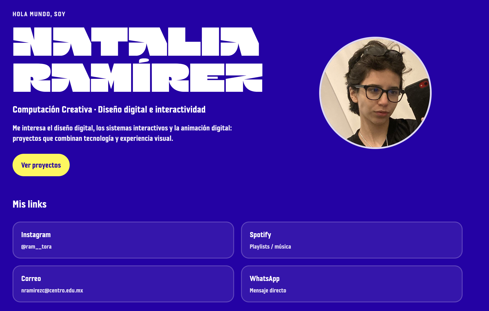

# RamTora03 · Personal Link Hub

Landing page personal tipo **link hub** pensada como raíz de navegación de mi ecosistema digital.

## Descripción conceptual

Este proyecto concentra mis enlaces sociales y de contacto en una sola interfaz.
El enfoque principal fue diseñar una experiencia clara y accesible desde móvil, cuidando:

- jerarquía visual
- estructura semántica
- layout responsive
- tipografía y contraste
- navegación simple y directa

La sección Hero funciona como primer impacto visual y punto de entrada hacia mis enlaces principales.

## Captura del Hero

> Coloca aquí tu imagen de captura (ejemplo recomendado: `img/hero-capture.png`).

## Enlaces

- [Instagram](https://www.instagram.com/ram__tora/)
- [Spotify](https://open.spotify.com/user/ajz32pbqlegfzqv2jc0p95rqz)
- [Correo](mailto:nramirezc@centro.edu.mx)
- [WhatsApp](https://wa.me/525621464031)

## Deploy (GitHub Pages)

- https://ramtora03.github.io/RamTora03/

## Estructura

- `index.html`
- `css/style.css`
- `img/profile.jpg`
- `img/favicon/`

